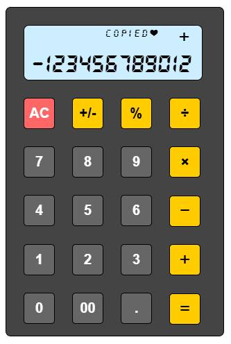

# vue-calculator

A simple toy-like calculator on your browser.

A demo project.

[Demo Page](https://macocci7.github.io/vue-calculator/)



## Usage

- Clone this repository
    ```bash
    git clone https://github.com/macocci7/vue-calculator.git
    ```
- Enter the folder
    ```bash
    cd vue-calculator
    ```
- Install dependencies
    ```bash
    npm install
    ```
- Run development server
    ```bash
    npm run dev
    ```
- Open the url below on your browser

    [http://localhost:5173/](http://localhost:5173/)

## LICENSE

[MIT](LICENSE)

Copyright 2025 macocci7.
